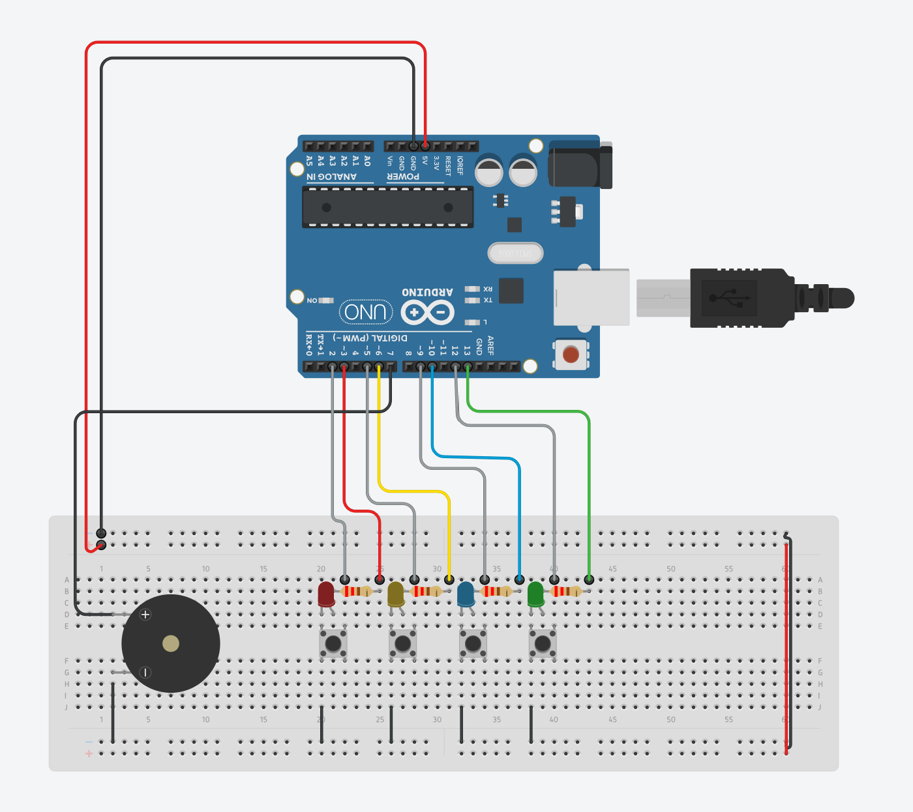
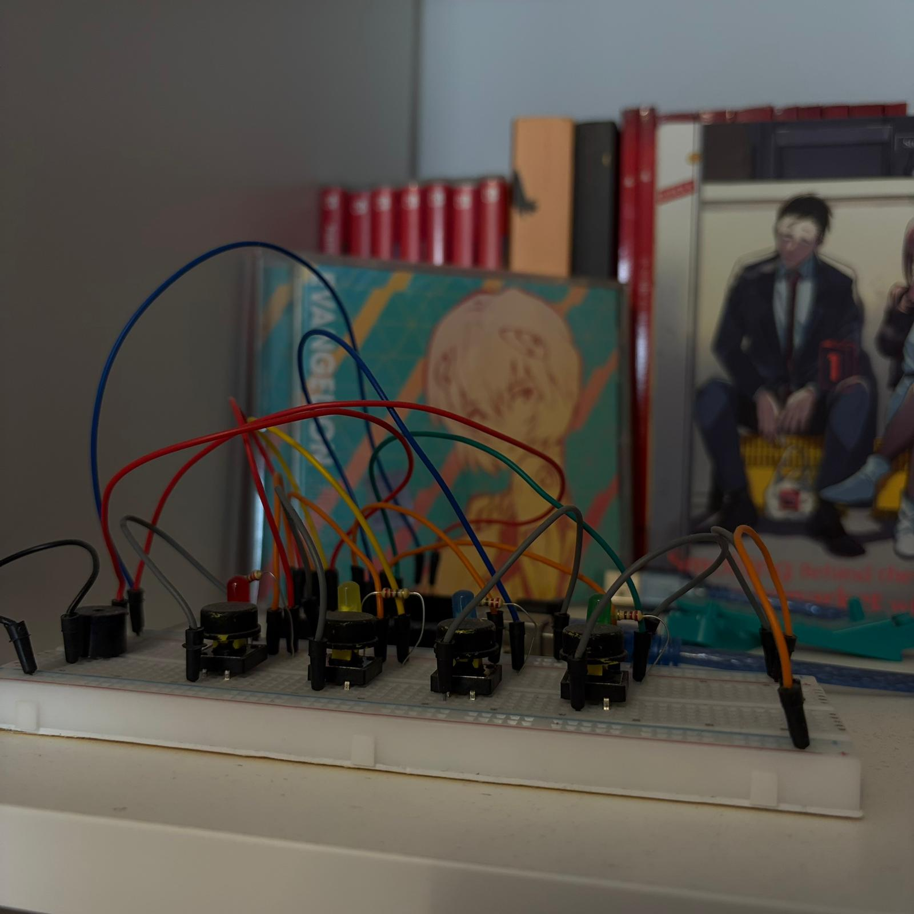

# Arduino Uno powered Color Memory Game

A color memory game built using an Arduino Uno for my Computer Architecture class.

## Inspiration

I was inspired to make this project by a short video that popped on my Instagram feed.

## Process

I began by modeling the project in TinkerCad first to make sure nothing would explode when assembling it irl.
I placed the LEDs, resistors and buttons and wrote the basic code, simulated it and then enhanced it by adding a buzzer to play some tunes.

Then I made it for real.

At first it worked, but after a few runs one of the LEDs stopped working. After tinkering a bit, I found out that it wasn't the LED and I had somehow destroyed one of the holes in the breadboard. I rearranged the elements and it hasn't malfunctioned since then.

## Final Product

https://github.com/user-attachments/assets/259bc58b-8cfc-4320-ab6e-8c154c2ec71c

